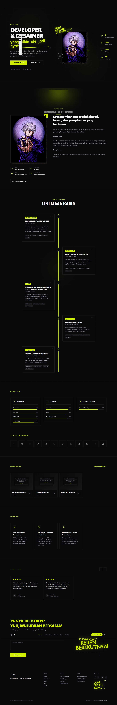
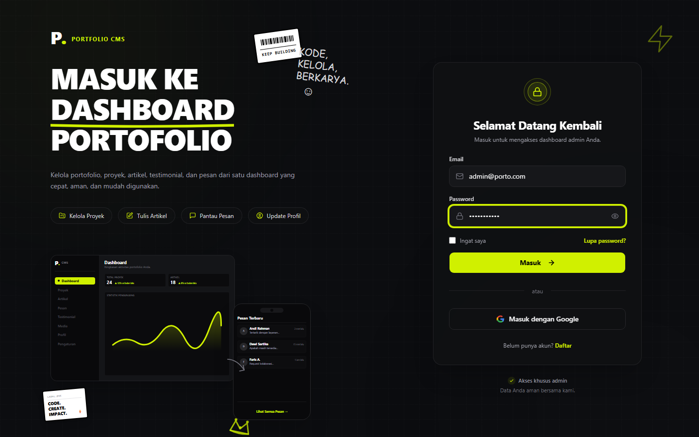
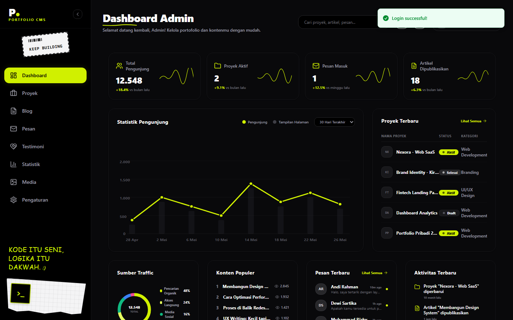

# ⚡ Zagoour Portfolio CMS Template ⚡

Template web portofolio full-stack monolith premium, sleek, dan animatif yang dibangun menggunakan **Next.js 16**, **Tailwind CSS v4**, **Prisma v7**, **NextAuth v5**, dan **Nginx**. Dilengkapi dengan panel CMS Admin terenkripsi untuk pengelolaan konten portofolio secara real-time tanpa perlu menyentuh baris kode.



---

## ✨ Fitur Utama

*   **Public Landing Page (SSR):** Animasi scroll-reveal Framer Motion yang halus, navigasi dinamis, visual *Lamp Effect* modern, grid proyek interaktif, galeri keahlian, dan form kontak leads.
*   **Modul Proyek (SSG):** Halaman detail proyek yang di-render secara statis (SSG) demi kecepatan loading secepat kilat dan optimasi SEO maksimum.
*   **Modul Blog (SSR):** Sistem artikel dengan filter kategori/tag dinamis dan pembaca Markdown dengan syntax highlighter untuk kode pemrograman.
*   **Secure CMS Admin Panel:** Dashboard manajemen konten terintegrasi (Hero, Bio, Skills, Projects, Blogs, Services, Testimonials, & Contacts inbox).
*   **Nginx Static Proxy Serve:** Akselerasi penyajian aset media `/uploads` langsung melalui Nginx bypass untuk efisiensi memori wadah (container).
*   **Keamanan Terenkripsi:** Enkripsi API Key dan data kredensial sensitif di sisi server menggunakan AES-256-GCM.

---

## 🛠️ Stack Teknologi

*   **Framework:** Next.js 16 (App Router, Turbopack)
*   **Database:** PostgreSQL 16
*   **ORM:** Prisma v7 (PrismaClient driver adapter `@prisma/adapter-pg` + `pg`)
*   **Authentication:** NextAuth v5 (Auth.js) - Credentials Provider
*   **Styling:** Tailwind CSS v4 + Magic UI & Aceternity UI components
*   **Animations:** Motion (Framer Motion v12)
*   **Reverse Proxy & File Server:** Nginx (Alpine-based)

---

## 📦 Prasyarat Instalasi (Prerequisites)

Sebelum menjalankan template ini di PC atau server VPS Anda, pastikan sistem Anda telah terpasang:
1.  **Docker** (v20.10.0 atau versi terbaru)
2.  **Docker Compose** (v2.0.0 atau versi terbaru)
3.  **Git** (untuk menduplikasi repositori)

---

## 🚀 Panduan Instalasi Cepat (Quick Start Guide)

Ikuti langkah-langkah mudah berikut untuk menjalankan aplikasi secara lokal di PC Anda:

### Langkah 1: Kloning Repositori
Buka terminal/power shell Anda dan jalankan perintah berikut:
```bash
git clone <url-repositori-anda> porto-modern
cd porto-modern
```

### Langkah 2: Konfigurasi Environment Variables (`.env`)
Salin file `.env.example` menjadi `.env` di root folder project:
```bash
# Untuk Linux/macOS
cp .env.example .env

# Untuk Windows (PowerShell)
copy .env.example .env
```
Buka file `.env` yang baru dibuat dan sesuaikan konfigurasi database atau biarkan default untuk pengujian lokal:
```env
POSTGRES_USER=postgres
POSTGRES_PASSWORD=postgres
POSTGRES_DB=porto_cms
AUTH_SECRET=super-secret-key-change-me-in-production-123456
NEXTAUTH_URL=http://localhost
```

### Langkah 3: Bangun & Jalankan Kontainer Docker
Jalankan orkestrasi Docker Compose untuk membangun image aplikasi dan menyalakan semua service:
```bash
docker compose up -d --build
```
*Proses build pertama kali akan memakan waktu 1-3 menit untuk meng-compile Next.js di dalam kontainer.*

### Langkah 4: Seed Database (Injeksi Data Awal & Akun Admin)
Setelah kontainer berjalan stabil, lakukan database seeding untuk membuat akun admin default dan data dummy portofolio:
```bash
docker compose exec -T frontend npx prisma db seed
```

---

## 🔑 Akses & Kredensial Default

Setelah seluruh proses instalasi di atas selesai, Anda dapat mengakses web melalui browser:

*   **Halaman Utama (Landing Page):** [http://localhost](http://localhost)
*   **Halaman Login CMS:** [http://localhost/login](http://localhost/login)



Gunakan akun administrator default berikut untuk login pertama kali:
*   **Email:** `admin@porto.com`
*   **Password:** `password123`

> [!WARNING]
> **PENTING:** Segera ubah email dan password default Anda setelah berhasil masuk pertama kali melalui panel **Site Settings** / **CMS Admin Settings** untuk mengamankan portofolio Anda.

---

## 🖥️ Preview Dashboard CMS

Kelola semua konten web Anda dengan mudah melalui antarmuka admin yang premium dan responsif:



---

## 🔧 Perintah Docker yang Berguna

Gunakan perintah-perintah berikut di terminal root project Anda untuk mengelola container:

```bash
# Melihat log aktivitas kontainer secara real-time
docker compose logs -f

# Melihat log khusus kontainer frontend (Next.js)
docker compose logs -f frontend

# Me-restart seluruh kontainer
docker compose restart

# Menghentikan aplikasi (data database tetap tersimpan aman di volume docker)
docker compose down

# Menghentikan aplikasi dan menghapus seluruh database (PERINGATAN: Semua data akan hilang)
docker compose down -v
```

---

*Made with  by Rissz Assistant.*
